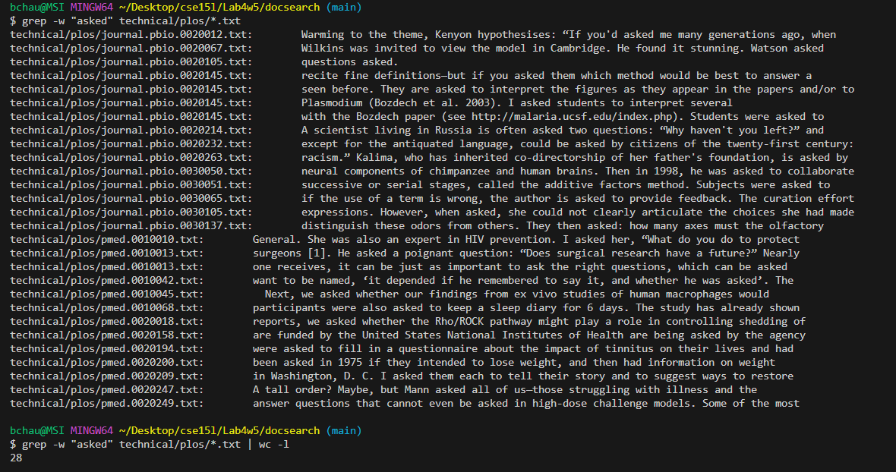

## Lab Report 3 - Bugs and Commands (Week 5)
## Part 2

The default grep command takes in two arguments-a string and a file path-and returns any instances of that string within the file. There are also variations of this command that have different behaviors and return different outputs, such as `grep -w`, `grep -r`, `grep -l`, and `grep -c`, to name a few. The mentioned variants are discussed below.

`grep -w`
The 'w' stands for "word", and using this variation will return any instances of the whole word within the file, excluding any words that may include this string as a substring. As you can see below, "attain" and "attainment" yield different results, even though one is a substring of the other. It could be useful for situations in which you are looking for a certain bit of information, but only remember a few key words.  
  

`grep -r`  
The 'r' stands for "recursive", and unlike other variations of `grep`, `grep -r` allows for the second argument to be a directory or a file name. If it is a directory it will be recursively searched through, meaning all subdirectories and their files will be searched for the given substring, and their paths will be returned along with a part of the sentence that contains the word. Providing a file path will return any instances of that substring within the given file. This could be useful if you are looking for particular bits data that may be spread among a large folder tree, as it will save a lot of time.  
  

`grep -c`  
This variation will take in a string and file path and return the amount of times the string occurs in that file. This could be useful if you are writing a script, you can use `grep -c` to count the occurances of certain patterns, such as error messages.  
  

`grep -l`
This variation will return only the paths of files that contain instances of the string. 
