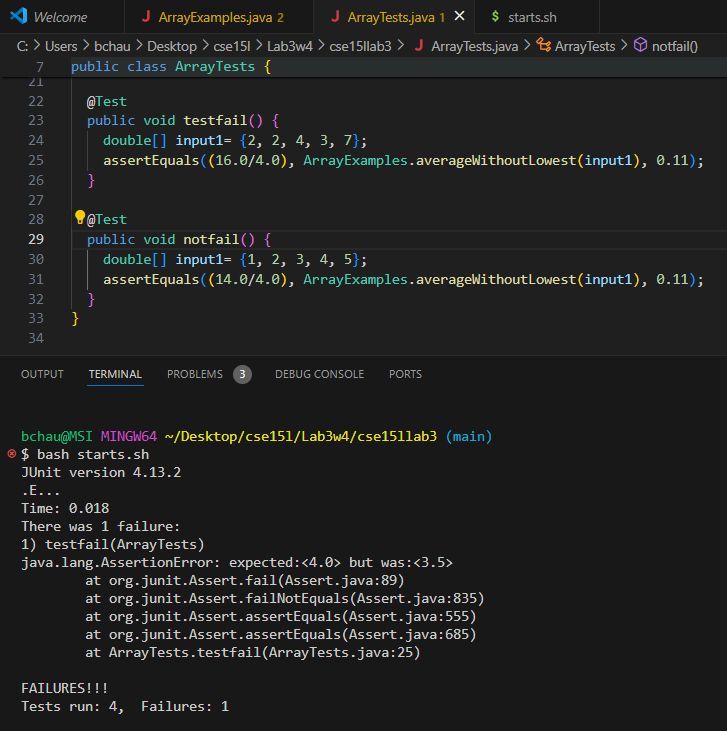

## Lab Report 3 - Bugs and Commands (Week 5)
---
## Part 1
The bug I chose to investigate for this lab is the `averageWithoutLowest` method, that is supposed to take an array and calculate the average of its elements while excluding the lowest value. However, the provided code failed to account for arrays that contain multiple instances of the lowest value.
1. Failure-Inducing Input:
```
@Test
  public void testfail() {
    double[] input1= {2, 2, 4, 3, 7};
    assertEquals((16.0/4.0), ArrayExamples.averageWithoutLowest(input1), 0.11);
  }
```
2. Input that does not induce failure:
```
@Test
  public void notfail() {
    double[] input1= {1, 2, 3, 4, 5};
    assertEquals((14.0/4.0), ArrayExamples.averageWithoutLowest(input1), 0.11);
  }
```
3. Symptom:  

 
5. The bug:

Before
```
static double averageWithoutLowest(double[] arr) {
    if(arr.length < 2) { return 0.0; }
    double lowest = arr[0];
    for(double num: arr) {
      if(num < lowest) { lowest = num; }
    }
    double sum = 0;
    for(double num: arr) {
      if(num != lowest) { sum += num; }
    }
    return sum / (arr.length - 1);
  }
```
After
```
static double averageWithoutLowest(double[] arr) {
    if(arr.length < 2) { return 0.0; }
    double lowest = arr[0];
    for(double num: arr) {
      if(num < lowest) { lowest = num; }
    }
    double sum = 0;
    int i = 0;
    for(double num: arr) {
      if(num != lowest) { sum += num; }
      else if (num == lowest && i == 0) { i++; }
      else { sum += num; }
    }
    return sum / (arr.length - 1);
  }
```
5. This fix addresses the issue because it includes a variable to account for how many times the lowest value has been excluded. If it has already been excluded once, then the variable will be incremented and prevent another instance from being excluded.
---
## Part 2

The default grep command takes in two arguments-a string and a file path-and returns any instances of that string within the file. There are also variations of this command that have different behaviors and return different outputs, such as `grep -w`, `grep -r`, `grep -c`, and `grep -l`, to name a few. The mentioned variants are discussed below.

`grep -w`
The 'w' stands for "word", and using this variation will return any instances of the whole word within the file, excluding any words that may include this string as a substring. As you can see below, "attain" and "attainment" yield different results, even though one is a substring of the other. It could be useful for situations in which you are looking for a certain bit of information, but only remember a few key words.  
```
bchau@MSI MINGW64 ~/Desktop/cse15l/Lab4w5/docsearch (main)
$ grep -w "attain" technical/biomed/*.txt
technical/biomed/1468-6708-3-3.txt:        non-pharmacologic lipid-lowering interventions to attain
technical/biomed/1471-2229-2-8.txt:          water required to attain the desired Ψ 
technical/biomed/1472-6904-1-2.txt:            effect, since color alone fails to attain
technical/biomed/1475-925X-2-12.txt:          tissue perfusion to attain simulation data near 100°C.
technical/biomed/gb-2001-2-4-research0010.txt:        not attain the same amino-acid composition predicted from

bchau@MSI MINGW64 ~/Desktop/cse15l/Lab4w5/docsearch (main)
$ grep -w "attainment" technical/biomed/*.txt
technical/biomed/1471-2261-1-6.txt:        attainment of therapeutic goals and contribute to the
technical/biomed/1475-9276-1-3.txt:        attainment or occupation [ 8 9 10 ] . And most researchers
technical/biomed/1475-9276-1-3.txt:        After all, if average health attainment is the same across
technical/biomed/1476-069X-2-7.txt:        educational attainment and household incomes than
technical/biomed/1477-7827-1-21.txt:        attainment of a threshold body mass. More importantly,
technical/biomed/1477-7827-1-21.txt:        attainment of a threshold body mass or energy reserves are
technical/biomed/rr37.txt:        low educational attainment, female gender, and
technical/biomed/rr37.txt:          association. Greater educational attainment was related
technical/biomed/rr37.txt:        income and educational attainment than the general
```

`grep -r`  
The 'r' stands for "recursive", and unlike other variations of `grep`, `grep -r` allows for the second argument to be a directory or a file name. If it is a directory it will be recursively searched through, meaning all subdirectories and their files will be searched for the given substring, and their paths will be returned along with a part of the sentence that contains the word. Providing a file path will return any instances of that substring within the given file. This could be useful if you are looking for particular bits data that may be spread among a large folder tree, as it will save a lot of time.  
```
bchau@MSI MINGW64 ~/Desktop/cse15l/Lab4w5/docsearch (main)
$ grep -r "attainment" technical/biomed/rr37.txt
        low educational attainment, female gender, and
          association. Greater educational attainment was related
        income and educational attainment than the general

bchau@MSI MINGW64 ~/Desktop/cse15l/Lab4w5/docsearch (main)
$ grep -r "attainment" technical/biomed/
technical/biomed/1471-2261-1-6.txt:        attainment of therapeutic goals and contribute to the
technical/biomed/1475-9276-1-3.txt:        attainment or occupation [ 8 9 10 ] . And most researchers
technical/biomed/1475-9276-1-3.txt:        After all, if average health attainment is the same across
technical/biomed/1476-069X-2-7.txt:        educational attainment and household incomes than
technical/biomed/1477-7827-1-21.txt:        attainment of a threshold body mass. More importantly,
technical/biomed/1477-7827-1-21.txt:        attainment of a threshold body mass or energy reserves are
technical/biomed/rr37.txt:        low educational attainment, female gender, and
technical/biomed/rr37.txt:          association. Greater educational attainment was related
technical/biomed/rr37.txt:        income and educational attainment than the general
```

`grep -c`  
This variation will take in a string and file path and return the amount of times the string occurs in that file. This could be useful if you are writing a script, you can use `grep -c` to count the occurances of certain patterns, such as error messages.  
```
bchau@MSI MINGW64 ~/Desktop/cse15l/Lab4w5/docsearch (main)
$ grep -c "attain" technical/biomed/
grep: technical/biomed/: Is a directory
0

bchau@MSI MINGW64 ~/Desktop/cse15l/Lab4w5/docsearch (main)
$ grep -c "attainment" technical/biomed/*.txt
technical/biomed/1468-6708-3-1.txt:0
technical/biomed/1468-6708-3-10.txt:0
technical/biomed/1468-6708-3-3.txt:0
technical/biomed/1468-6708-3-4.txt:0
technical/biomed/1468-6708-3-7.txt:0
technical/biomed/1471-2091-2-10.txt:0
technical/biomed/1471-2091-2-11.txt:0
technical/biomed/1471-2091-2-12.txt:0
technical/biomed/1471-2091-2-13.txt:0
technical/biomed/1471-2091-2-16.txt:0
technical/biomed/1471-2091-2-5.txt:0
technical/biomed/1471-2091-2-7.txt:0
technical/biomed/1471-2091-2-9.txt:0
technical/biomed/1471-2091-3-13.txt:0
technical/biomed/1471-2091-3-14.txt:0
technical/biomed/1471-2091-3-15.txt:0
technical/biomed/1471-2091-3-16.txt:0
technical/biomed/1471-2091-3-17.txt:0
technical/biomed/1471-2091-3-18.txt:0
technical/biomed/1471-2091-3-22.txt:0
technical/biomed/1471-2091-3-23.txt:0
technical/biomed/1471-2091-3-30.txt:0
technical/biomed/1471-2091-3-31.txt:0
technical/biomed/1471-2091-3-4.txt:0
technical/biomed/1471-2091-3-8.txt:0
technical/biomed/1471-2091-4-1.txt:0
technical/biomed/1471-2091-4-5.txt:0
technical/biomed/1471-2105-1-1.txt:0
technical/biomed/1471-2105-2-1.txt:0
...
```

`grep -l`  
This variation will return only the paths of files that contain instances of the string or pattern. This can be useful for filtering out files that contain relevant information which can make it easier to focus and ogranize. This can also be paired with other commands to modify or perform other actions on these files.
```
bchau@MSI MINGW64 ~/Desktop/cse15l/Lab4w5/docsearch (main)
$ grep -l "attainment" technical/biomed/*.txt
technical/biomed/1471-2261-1-6.txt
technical/biomed/1475-9276-1-3.txt
technical/biomed/1476-069X-2-7.txt
technical/biomed/1477-7827-1-21.txt
technical/biomed/rr37.txt

bchau@MSI MINGW64 ~/Desktop/cse15l/Lab4w5/docsearch (main)
$ grep -l "attainment" technical/plos/*.txt
technical/plos/pmed.0020016.txt
technical/plos/pmed.0020162.txt

bchau@MSI MINGW64 ~/Desktop/cse15l/Lab4w5/docsearch (main)
$ grep -l "attainment of" technical/plos/*.txt
technical/plos/pmed.0020016.txt
```

