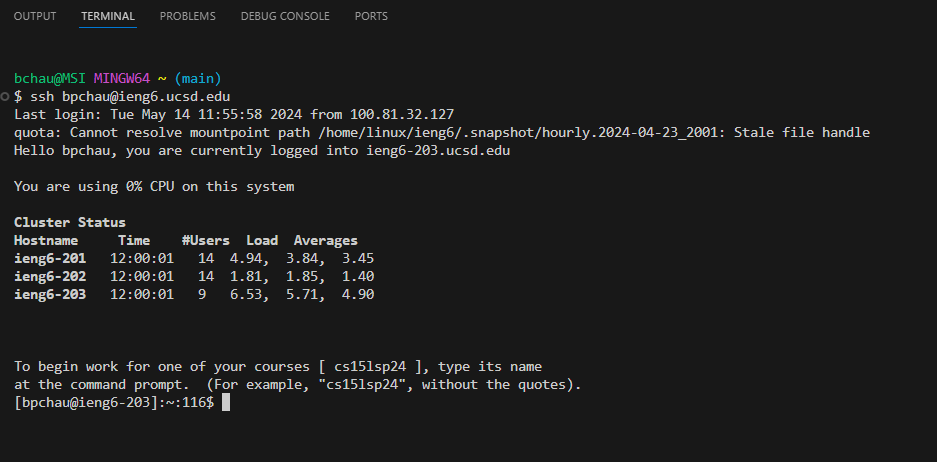
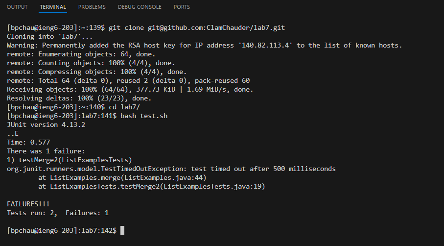
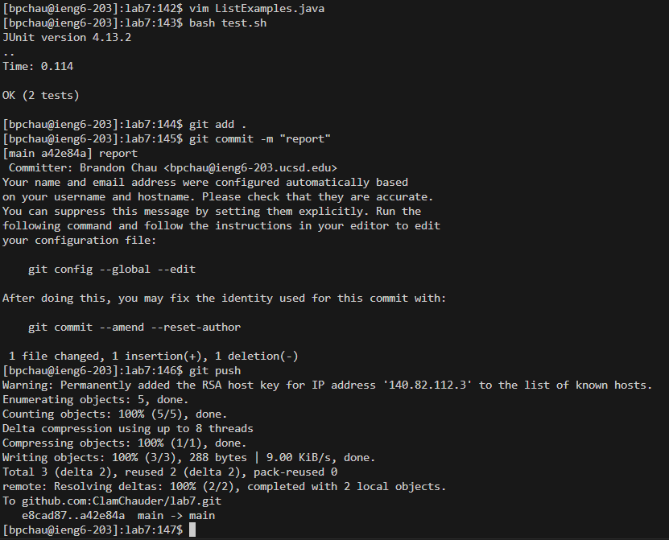

## Lab Report 4 - Vim (Week 7)
---

`<up><up><enter>`  
I used the arrow keys to access the `ssh bpchau@ieng6.ucsd.edu` command which was 2 up in the search history.

  
`<up><up><up><up><up><up><up><up><up><up><up><up><up><up><up><up><up><up><enter>`  
I was not sure how far up the `git clone` command was, so I used the arrow keys, but it would have been faster if I had typed it out.  

`cd<space>la<tab><enter>`  
The `cd` command is fairly short, so I decided it would be faster to type it out.  

`bash<space>t<tab><enter>`  
Similarly, the bash command is short.

  
`<up><up><up><up><up><up><up><up><up><up><up><enter>`, `<:44><right><right><right><right><right><x><i><2><esc><:wq><enter>`  
Used the up arrow keys to find the `vim ListExamples.java` command, which opened the file to edit. Then I typed `:44` which brought me to the line that needed to be edited. I knew this was the line due to the previous lab instructions. It brought me to the beginning of the line, so I used the right arrow key to hover over the 1 in `index1`, delete it with `<x>`, and insert a 2 with `<i>`. I then used `<:wq>` to save and close the file.  

`<up><up><enter>`, `git<space>add<space>.<enter>`, `git<space>commit<space>-m<space>"report"<enter>`, `git<space>push<enter>`  
Since I just used the `bash` command recently, I used the arrow keys to retrieve it again. I also knew that it had been a while since I used the commands to commit and push the changes, so I decided to type them out.
